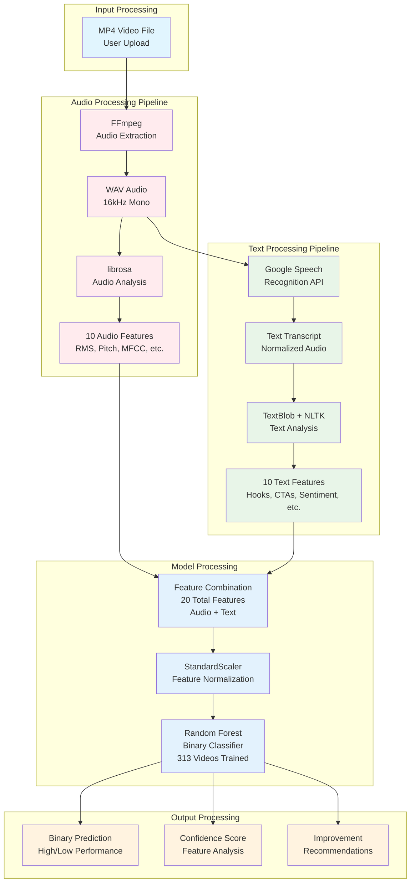

# Model Architecture Diagram

## Advertisement Prediction Engine - Model Architecture

## Key Architecture Components

### Audio Processing Pipeline
- **FFmpeg**: Extracts audio from MP4 files
- **librosa**: Analyzes audio characteristics
- **10 Audio Features**: Focus on attention-grabbing qualities

### Text Processing Pipeline  
- **Google Speech Recognition**: Converts audio to text
- **TextBlob + NLTK**: Analyzes text structure and sentiment
- **10 Text Features**: Focus on marketing effectiveness

### Model Architecture
- **Single Random Forest**: Processes 20 combined features
- **StandardScaler**: Normalizes features for consistent processing
- **Binary Classification**: High vs. Low performance prediction

### Performance Metrics
- **Training Data**: 313 videos from diverse brands
- **Accuracy**: 65% cross-validated
- **Validation**: Both within and outside training set
