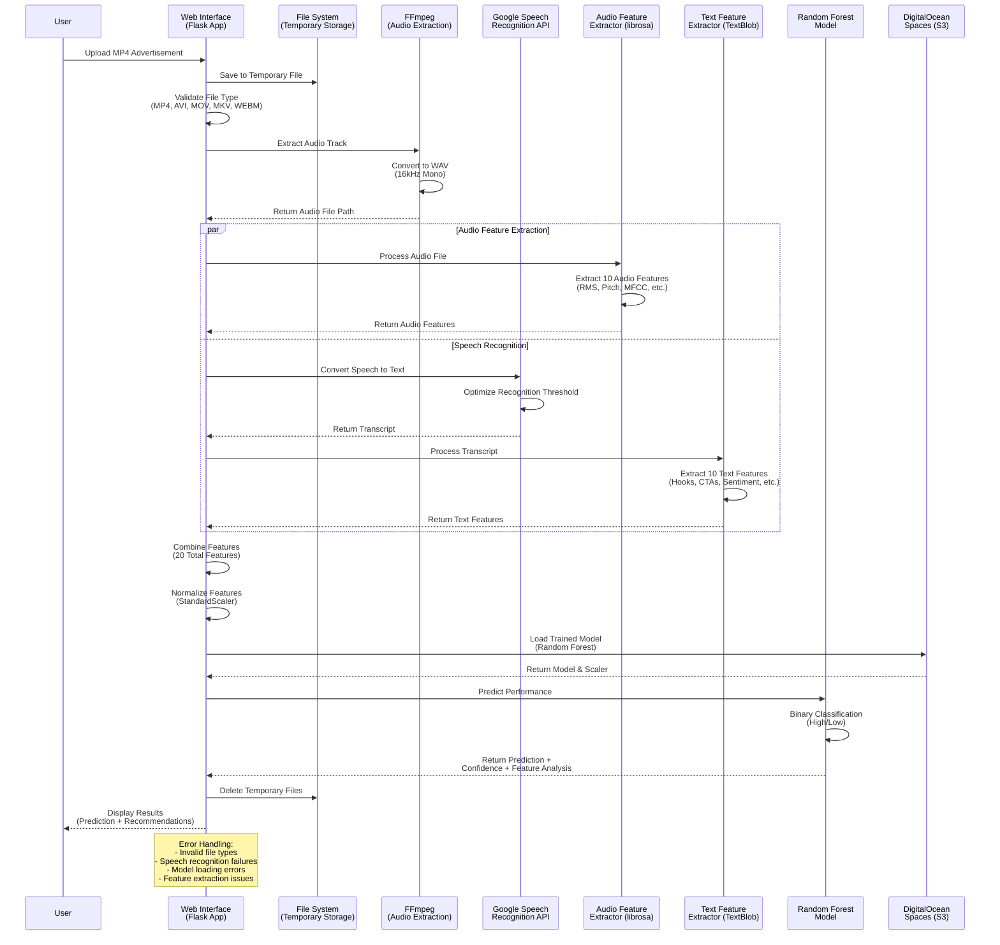

# Application Workflow Diagram

## Advertisement Prediction Engine - Data Flow for Single Prediction

## Workflow Stages

### Stage 1: File Upload & Validation
- User uploads MP4 video file
- System validates file type and size
- File saved to temporary storage

### Stage 2: Audio Extraction
- FFmpeg extracts audio track from video
- Converts to 16kHz mono WAV format
- Optimized for speech recognition

### Stage 3: Parallel Feature Extraction
- **Audio Features**: librosa analyzes 10 audio characteristics
- **Text Features**: Google Speech Recognition + TextBlob analyze 10 text characteristics
- Both processes run simultaneously for efficiency

### Stage 4: Model Processing
- Features combined into 20-feature vector
- StandardScaler normalizes features
- Random Forest model loaded from S3 storage
- Binary classification performed

### Stage 5: Response & Cleanup
- Prediction results formatted for user
- Temporary files cleaned up
- Error handling throughout process

## Performance Characteristics

### Processing Time
- **Audio Extraction**: ~2-5 seconds
- **Feature Extraction**: ~3-8 seconds (parallel)
- **Model Prediction**: ~0.1 seconds
- **Total**: ~5-13 seconds per video

### Error Handling
- Invalid file types rejected
- Speech recognition failures handled gracefully
- Model loading errors with fallback
- Feature extraction issues with default values

### Scalability
- Stateless processing (no session storage)
- Temporary file cleanup prevents storage bloat
- S3 model storage enables horizontal scaling
- Parallel processing optimizes throughput
